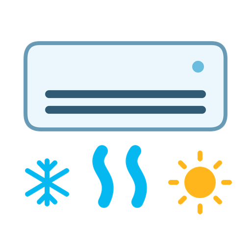

# 🌡️ BaillClim – Intégration BaillConnect pour Home Assistant

<p align="left"></p>

> **Projet communautaire indépendant, non affilié au fabricant.** Cette icône est une création originale pour cette intégration, pas un logo officiel. Les noms des fabricants désignent uniquement les appareils compatibles.

[Sources et variantes du logo](custom_components/baillclim/brand/) · [Publication 6.2.3](https://github.com/hebrru/baillclim/releases/tag/v6.2.3)


[](https://www.buymeacoffee.com/herbru01d)

Développé par @hebrru

---

## 🔧 Description

**BaillClim** est une intégration personnalisée pour **Home Assistant**, permettant de piloter vos thermostats connectés via le portail [baillconnect.com](https://www.baillconnect.com).  
Elle offre un contrôle complet de votre système de climatisation gainable, pièce par pièce, zone par zone, et prend en charge plusieurs passerelles ou régulations.

---

## 🧩 Entités disponibles

L’intégration crée automatiquement les entités suivantes en fonction des données disponibles dans votre compte :

### 🔥 `climate.baillclim_*`
Thermostats BaillConnect avec les fonctionnalités suivantes :
- 🟢 Allumage/extinction
- 🌡️ Température ambiante
- ❄️ Consigne froide (gauche)
- 🔥 Consigne chaude (droite)
- 🔄 Mode AUTO ou OFF (selon état réel)

### 🌀 `select.mode_climatisation`
Contrôle du mode général du système :
- Arrêt, Froid, Chauffage, Désumidificateur, Ventilation

### 🌡️ `sensor.baillclim_temp_*`
Capteurs de température ambiante pour chaque thermostat, lisibles séparément.

### 💡 `switch.zone_*_active`
Permet d’activer/désactiver une zone programmée :
- Active = mode `3`
- Inactive = mode `0`

### 🐞 `sensor.debug_baillconnect_data`
Capteur spécial contenant **l'intégralité des données JSON brutes** retournées par l'API.  
Utile pour le debug ou l’extraction avancée.

---

## 🧠 Points forts

✅ Détection automatique des thermostats, zones et régulations  
✅ Aucune configuration manuelle des ID  
✅ Prise en charge de plusieurs régulations sur le même compte  
✅ Préparation pour un usage multi-compte / multi-passerelle  
✅ Entièrement compatible Lovelace  
✅ Fonctionne sans dépendance cloud tierce – connexion directe au site BaillConnect  

---

## 🚀 Installation via HACS

1. Ajouter le dépôt personnalisé :  
```
https://github.com/hebrru/baillclim
```

2. Dans HACS :
    - HACS → Intégrations → (⋮) → Dépôts personnalisés
    - Catégorie : **Intégration**
    - Rechercher **BaillClim**
    - Installer

3. Redémarrer Home Assistant

4. Paramètres → Appareils & Services → Ajouter une intégration  
   Rechercher **BaillClim** et entrer vos identifiants BaillConnect

---

## 🛠️ Exemple d’automatisation YAML

```yaml
alias: "Changer mode clim vers Ventilation"
trigger:
  - platform: time
    at: "12:00:00"
action:
  - service: select.select_option
    data:
      entity_id: select.mode_climatisation
      option: Ventilation
```

---

## 🧠 Suggestions / Bugs / Améliorations

👉 Créez une **issue GitHub** pour proposer une idée ou signaler un problème.

---

## 👤 Auteur

Hervé G.  
GitHub : [@hebrru](https://github.com/hebrru)  
☕ [Buy Me A Coffee](https://www.buymeacoffee.com/herbru01d)